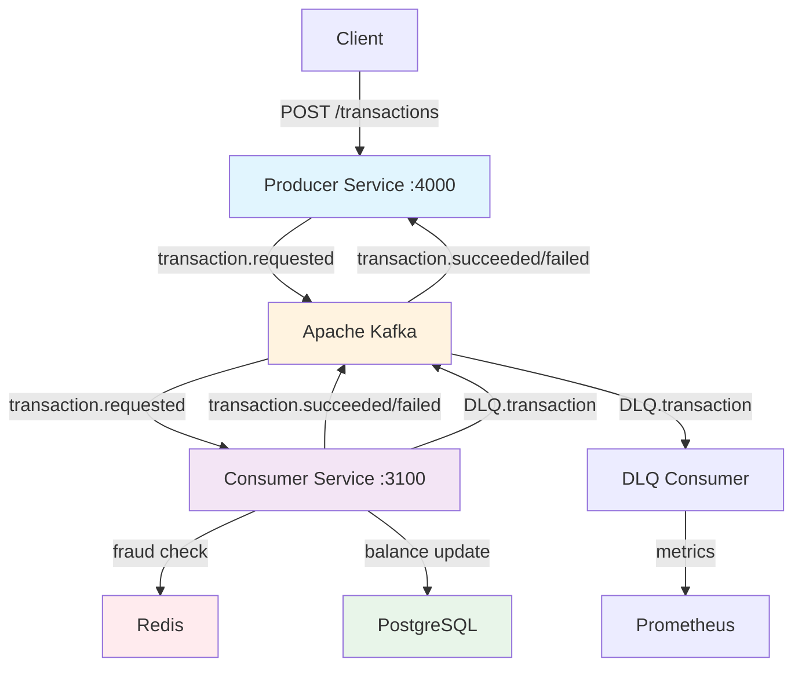
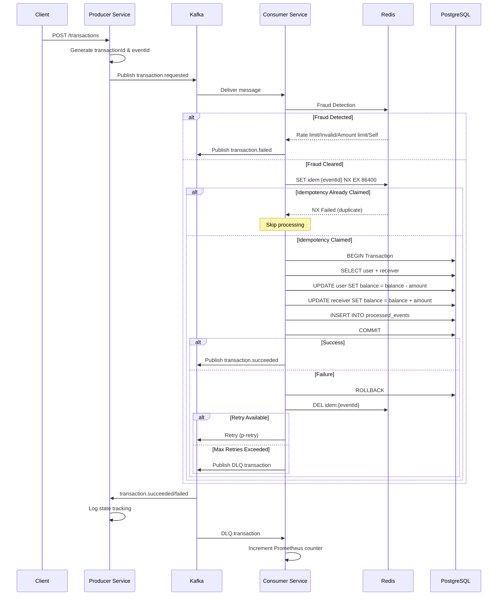

# Financial Transaction Processing Pipeline Documentation

## 1. README.md

# Real-Time Financial Transaction Pipeline

A production-grade, event-driven financial transaction processing system built with NestJS, Apache Kafka, PostgreSQL, and Redis. The system handles real-time money transfers with built-in fraud detection, idempotency guarantees, and comprehensive error handling.

## Features

- **Event-Driven Architecture**: Decoupled services communicating via Kafka
- **Fraud Detection**: Real-time validation with Redis-based rate limiting
- **Exactly-Once Processing**: Idempotency guarantees using Redis distributed locks
- **Resilience**: Automatic retries with exponential backoff and DLQ fallback
- **Observability**: Prometheus metrics and structured logging
- **Atomic Transactions**: ACID-compliant balance transfers

## Architecture Overview



## Prerequisites

- Node.js 18+
- Apache Kafka (localhost:9092)
- PostgreSQL 14+ (localhost:5432)
- Redis 6+ (localhost:6379)
- npm/yarn

## Quick Start

### 1. Clone and Install

```bash
git clone <repository-url>
cd financial-pipeline

# Install dependencies for both services
cd producer && npm install
cd ../consumer && npm install
```

### 2. Environment Configuration

#### Producer Service (.env)
```env
KAFKA_BROKERS=localhost:9092
KAFKA_CLIENT_ID=producer-service
KAFKA_GROUP_ID=producer-group
PORT=4000
```

#### Consumer Service (.env)
```env
KAFKA_BROKERS=localhost:9092
KAFKA_CLIENT_ID=consumer-service
KAFKA_GROUP_ID=transaction-group
POSTGRES_HOST=localhost
POSTGRES_PORT=5432
POSTGRES_DB=tesst
POSTGRES_USER=postgres
POSTGRES_PASSWORD=postgres
REDIS_HOST=localhost
REDIS_PORT=6379
REDIS_PASSWORD=
PORT=3100
```

### 3. Run Services

```bash
# Terminal 1: Producer
cd producer
npm run start:dev

# Terminal 2: Consumer
cd consumer
npm run start:dev
```

### 4. Test the Pipeline

```bash
curl -X POST http://localhost:4000/transactions \
  -H "Content-Type: application/json" \
  -d '{
    "userId": "550e8400-e29b-41d4-a716-446655440000",
    "receiverId": "550e8400-e29b-41d4-a716-446655440001",
    "amount": 100.50
  }'
```

## Kafka Topics

| Topic | Direction | Purpose | Partition Key |
|-------|-----------|---------|---------------|
| `transaction.requested` | Producer → Consumer | Inbound transaction requests | transactionId |
| `transaction.succeeded` | Consumer → Producer | Successful state notification | transactionId |
| `transaction.failed` | Consumer → Producer | Rejected due to fraud/validation | transactionId |
| `DLQ.transaction` | Consumer → Consumer | Poison messages after retries | eventId |

## Service Endpoints

### Producer Service
- **Health**: `GET /health` - Service health check
- **Metrics**: `GET /metrics` - Prometheus metrics
- **Transactions**: `POST /transactions` - Submit transaction

### Consumer Service
- **Health**: `GET /health` - Service health check  
- **Metrics**: `GET /metrics` - Prometheus metrics

## Project Structure

```
.
├── producer/
│   ├── src/
│   │   ├── modules/
│   │   │   ├── transactions/
│   │   │   ├── kafka/
│   │   │   ├── outbox/
│   │   │   └── common/
│   │   └── main.ts
│   └── package.json
├── consumer/
│   ├── src/
│   │   ├── modules/
│   │   │   ├── user/
│   │   │   ├── fraud-detection/
│   │   │   ├── idempotency/
│   │   │   ├── kafka/
│   │   │   ├── redis/
│   │   │   └── metrics/
│   │   └── main.ts
│   └── package.json
└── README.md
```

---

## 2. API Reference

# Transaction API Reference

## POST /transactions

Submit a new financial transaction for processing.

### Endpoint

```
POST http://localhost:4000/transactions
Content-Type: application/json
```

### Request Schema

```typescript
interface TransactionRequest {
  userId: string;      // UUID of the sender
  receiverId: string;  // UUID of the recipient
  amount: number;      // Positive amount > 0
}
```

#### Example Request

```json
{
  "userId": "550e8400-e29b-41d4-a716-446655440000",
  "receiverId": "550e8400-e29b-41d4-a716-446655440001",
  "amount": 150.75
}
```

### Response Schema

#### Success Response (202 Accepted)

```json
{
  "transactionId": "a0eebc99-9c0b-4ef8-bb6d-6bb9bd380a11",
  "eventId": "b1febc99-9c0b-4ef8-bb6d-6bb9bd380a12",
  "status": "pending",
  "message": "Transaction submitted for processing"
}
```

#### Error Responses

**400 Bad Request** - Validation Failed
```json
{
  "statusCode": 400,
  "message": ["amount must be a positive number"],
  "error": "Bad Request"
}
```

**429 Too Many Requests** - Rate Limited
```json
{
  "statusCode": 429,
  "message": "Rate limit exceeded: 5 requests per 60 seconds",
  "error": "Too Many Requests"
}
```

**403 Forbidden** - Self Transfer
```json
{
  "statusCode": 403,
  "message": "Self transfers are not allowed",
  "error": "Forbidden"
}
```

**400 Bad Request** - Insufficient Funds
```json
{
  "statusCode": 400,
  "message": "Insufficient balance",
  "error": "Bad Request"
}
```

**500 Internal Server Error** - System Failure
```json
{
  "statusCode": 500,
  "message": "Transaction processing failed",
  "error": "Internal Server Error"
}
```

### Error Codes Reference

| HTTP Code | Error Type | Description |
|-----------|------------|-------------|
| 400 | INVALID_AMOUNT | Amount ≤ 0 |
| 400 | AMOUNT_LIMIT_EXCEEDED | Amount > 10,000 |
| 400 | INSUFFICIENT_BALANCE | User has insufficient funds |
| 403 | SELF_TRANSFER | userId equals receiverId |
| 429 | RATE_LIMIT_EXCEEDED | >5 requests per 60 seconds |
| 409 | DUPLICATE_TRANSACTION | Idempotency violation |
| 500 | SYSTEM_ERROR | Unhandled system error |

---

## 3. Architecture Guide

# Architecture Guide

## System Overview

The financial pipeline employs a microservices architecture with two independent NestJS services communicating asynchronously via Apache Kafka. This design ensures high availability, scalability, and fault tolerance.

## Detailed Data Flow

### Sequence Diagram



## Module Responsibilities

### Producer Service Modules

#### TransactionsModule
- **Controller**: Handles HTTP requests, validates input
- **Service**: Enriches events with UUIDs, delegates to Kafka
- **Consumer**: Listens for `transaction.succeeded`/`transaction.failed` for logging

#### KafkaModule
- **ProducerSvc**: KafkaJS producer wrapper with lifecycle management
- **ConsumerSvc**: Generic consumer wrapper with configurable groups
- **Lifecycle**: Auto-connect on module init, disconnect on shutdown

#### OutboxModule (Stub)
- **Purpose**: Future implementation of transactional outbox pattern
- **Current**: Placeholder for database-backed event persistence

#### Common Module
- **Loggsvc**: Structured logging wrapper
- **Shared DTOs**: Data transfer objects for event schemas

### Consumer Service Modules

#### UserModule
- **Core Processing**: Manages the entire transaction lifecycle
- **Balance Transfers**: Atomic database operations in TypeORM transaction
- **Error Handling**: Comprehensive retry logic with p-retry

#### FraudDetectionModule
- **Rate Limiting**: Redis-based sliding window (5 requests/60s)
- **Validation**: Amount checks, self-transfer detection
- **Redis Integration**: Atomic operations for rate limit tracking

#### IdempotencyModule
- **Distributed Lock**: Redis SET NX with 24-hour TTL
- **Duplicate Detection**: Ensures exactly-once processing
- **Key Management**: Automatic cleanup on transaction completion

#### KafkaModule
- **ProducerSvc**: Event publishing for `transaction.succeeded/failed`
- **ConsumerSvc**: Two consumers (main and DLQ) with distinct groups

#### RedisModule (@Global)
- **Client Provider**: ioredis with retry strategy
- **Connection Management**: Automatic reconnection with backoff
- **Configuration**: Host/port/password from environment

#### MetricsModule
- **Prometheus Integration**: @willsoto/nestjs-prometheus
- **DLQ Counter**: `dlq_messages_total` metric
- **Export**: Metrics endpoint at `/metrics`

## Database Schema

### User Entity
```typescript
@Entity()
export class User {
  @PrimaryGeneratedColumn('uuid')
  id: string;

  @Column({ type: 'decimal', precision: 20, scale: 2 })
  balance: number;

  @Column()
  name: string;
}
```

### ProcessedEvent Entity
```typescript
@Entity()
export class ProcessedEvent {
  @PrimaryGeneratedColumn('uuid')
  id: string;

  @Column({ unique: true })
  eventId: string;

  @Column()
  processedAt: Date;
}
```

### DLQ Schema
```typescript
interface DLQMessage {
  transactionId: string;
  eventId: string;
  userId: string;
  amount: number;
  receiverId: string;
  createdAt: Date;
  error: {
    code: string;
    message: string;
    attempts: number;
    timestamp: Date;
  };
}
```

---

## 4. Developer Guide

# Developer Guide

## Local Development Setup

### 1. Infrastructure Setup

#### Option A: Docker Compose (Recommended)
```yaml
version: '3.8'
services:
  zookeeper:
    image: confluentinc/cp-zookeeper:latest
    environment:
      ZOOKEEPER_CLIENT_PORT: 2181
    ports:
      - "2181:2181"

  kafka:
    image: confluentinc/cp-kafka:latest
    depends_on:
      - zookeeper
    environment:
      KAFKA_BROKER_ID: 1
      KAFKA_ZOOKEEPER_CONNECT: zookeeper:2181
      KAFKA_ADVERTISED_LISTENERS: PLAINTEXT://localhost:9092
      KAFKA_OFFSETS_TOPIC_REPLICATION_FACTOR: 1
    ports:
      - "9092:9092"

  postgres:
    image: postgres:14
    environment:
      POSTGRES_DB: tesst
      POSTGRES_USER: postgres
      POSTGRES_PASSWORD: postgres
    ports:
      - "5432:5432"
    volumes:
      - postgres_data:/var/lib/postgresql/data

  redis:
    image: redis:6-alpine
    ports:
      - "6379:6379"
```

#### Option B: Manual Installation
```bash
# Install Kafka
brew install kafka
brew services start zookeeper
brew services start kafka

# Install PostgreSQL
brew install postgresql@14
brew services start postgresql@14
createdb tesst

# Install Redis
brew install redis
brew services start redis
```

### 2. Service Configuration

#### Producer Service
```bash
cd producer
cp .env.example .env
npm install
npm run build
npm run start:dev
```

#### Consumer Service
```bash
cd consumer
cp .env.example .env
npm install
npm run build
npm run start:dev
```

### 3. Debugging

#### VS Code Launch Configuration
```json
{
  "version": "0.2.0",
  "configurations": [
    {
      "type": "node",
      "request": "attach",
      "name": "Attach to Producer",
      "port": 9229,
      "restart": true,
      "skipFiles": ["<node_internals>/**"]
    },
    {
      "type": "node",
      "request": "attach",
      "name": "Attach to Consumer",
      "port": 9230,
      "restart": true,
      "skipFiles": ["<node_internals>/**"]
    }
  ]
}
```

#### Logging
```typescript
// Producer logging
this.loggsvc.log('Transaction requested', {
  transactionId,
  userId,
  amount
});

// Consumer logging
this.loggsvc.log('Processing transaction', {
  eventId,
  userId,
  attempts: retryContext.attemptNumber
});
```

## Adding a New Fraud Rule

### Step 1: Define the Rule in FraudDetectionService
```typescript
// consumer/src/modules/fraud-detection/fraud-detection.service.ts
export class FraudDetectionService {
  private readonly MAX_DAILY_AMOUNT = 5000;

  async checkFraud(dto: TransferMoneyDto): Promise<FraudResult> {
    // Existing rules...
    
    // New rule: Daily limit
    if (await this.isDailyLimitExceeded(dto.userId, dto.amount)) {
      return {
        flagged: true,
        reason: 'DAILY_LIMIT_EXCEEDED',
        message: 'Daily transaction limit exceeded'
      };
    }
    
    return { flagged: false };
  }

  private async isDailyLimitExceeded(userId: string, amount: number): Promise<boolean> {
    const today = new Date().toDateString();
    const key = `daily:${userId}:${today}`;
    const currentTotal = await this.redisClient.get(key);
    const total = currentTotal ? parseFloat(currentTotal) : 0;
    
    if (total + amount > this.MAX_DAILY_AMOUNT) {
      return true;
    }
    
    // Update daily total
    await this.redisClient.incrbyfloat(key, amount);
    await this.redisClient.expire(key, 86400); // 24 hours
    
    return false;
  }
}
```

### Step 2: Add Error Code
```typescript
// producer/src/modules/common/error-codes.ts
export enum FraudReason {
  RATE_LIMIT_EXCEEDED = 'RATE_LIMIT_EXCEEDED',
  INVALID_AMOUNT = 'INVALID_AMOUNT',
  AMOUNT_LIMIT_EXCEEDED = 'AMOUNT_LIMIT_EXCEEDED',
  SELF_TRANSFER = 'SELF_TRANSFER',
  DAILY_LIMIT_EXCEEDED = 'DAILY_LIMIT_EXCEEDED', // New
}
```

## Adding a New Kafka Topic/Consumer

### Producer Side
```typescript
// producer/src/modules/kafka/kafka.module.ts
@Module({
  providers: [
    {
      provide: 'NEW_TOPIC_PRODUCER',
      useFactory: (kafkaService: KafkaService) => {
        return kafkaService.getProducer();
      },
      inject: [KafkaService],
    },
  ],
})
export class KafkaModule {}

// producer/src/modules/transactions/transactions.service.ts
export class TransactionsService {
  constructor(
    @Inject('NEW_TOPIC_PRODUCER') private producer: Producer,
  ) {}

  async publishToNewTopic(data: any) {
    await this.producer.send({
      topic: 'new.topic',
      messages: [{
        key: data.id,
        value: JSON.stringify(data),
      }],
    });
  }
}
```

### Consumer Side
```typescript
// consumer/src/modules/kafka/kafka.module.ts
@Module({
  providers: [
    {
      provide: 'NEW_CONSUMER',
      useFactory: (kafkaService: KafkaService) => {
        return kafkaService.createConsumer({
          groupId: 'new-consumer-group',
          topics: ['new.topic'],
          autoCommit: true,
        });
      },
      inject: [KafkaService],
    },
  ],
})
export class KafkaModule {}

// consumer/src/modules/transactions/new-consumer.service.ts
@Injectable()
export class NewConsumerService implements OnModuleInit, OnApplicationShutdown {
  constructor(
    @Inject('NEW_CONSUMER') private consumer: Consumer,
    private loggsvc: Loggsvc,
  ) {}

  async onModuleInit() {
    await this.consumer.run({
      eachMessage: async ({ message }) => {
        const data = JSON.parse(message.value.toString());
        await this.processMessage(data);
      },
    });
  }

  async processMessage(data: any) {
    this.loggsvc.log('Processing new topic message', data);
    // Your business logic here
  }
}
```

### Update Topics Configuration
```typescript
// consumer/src/config/kafka.config.ts
export const KAFKA_TOPICS = {
  TRANSACTION_REQUESTED: 'transaction.requested',
  TRANSACTION_SUCCEEDED: 'transaction.succeeded',
  TRANSACTION_FAILED: 'transaction.failed',
  DLQ_TRANSACTION: 'DLQ.transaction',
  NEW_TOPIC: 'new.topic', // New
} as const;
```

---

## 5. Operations Guide

# Operations Guide

## Monitoring & Observability

### Prometheus Metrics

#### Metrics Endpoint
```bash
# Producer
curl http://localhost:4000/metrics

# Consumer
curl http://localhost:3100/metrics
```

#### Key Metrics
| Metric | Type | Description |
|--------|------|-------------|
| `dlq_messages_total` | Counter | Total messages sent to DLQ |
| `http_requests_total` | Counter | Total HTTP requests |
| `http_request_duration_seconds` | Histogram | Request latency |
| `kafka_messages_consumed_total` | Counter | Messages consumed from Kafka |
| `kafka_messages_produced_total` | Counter | Messages produced to Kafka |

#### Custom Metrics
```typescript
// Adding a new metric in consumer
@Injectable()
export class FraudDetectionService {
  private readonly fraudCounter: Counter<string>;

  constructor(private prometheusService: PrometheusService) {
    this.fraudCounter = this.prometheusService.registerCounter({
      name: 'fraud_detected_total',
      help: 'Total fraud detections by type',
      labelNames: ['reason'],
    });
  }

  async checkFraud(dto: TransferMoneyDto): Promise<FraudResult> {
    // ... fraud check logic
    
    if (result.flagged) {
      this.fraudCounter.labels(result.reason).inc();
    }
  }
}
```

### Health Checks

#### Producer Health Check
```json
GET /health
{
  "status": "ok",
  "services": {
    "kafka": "connected",
    "redis": "connected",
    "postgres": "connected"
  },
  "timestamp": "2024-01-15T10:30:00Z"
}
```

#### Consumer Health Check
```json
GET /health
{
  "status": "ok",
  "services": {
    "kafka": "connected",
    "redis": "connected",
    "postgres": "connected"
  },
  "consumers": {
    "transaction-group": "running",
    "dlq-group": "running"
  },
  "timestamp": "2024-01-15T10:30:00Z"
}
```

### DLQ Replay Strategy

#### Viewing DLQ Messages
```bash
# Consumer DLQ topic messages
kafka-console-consumer \
  --bootstrap-server localhost:9092 \
  --topic DLQ.transaction \
  --from-beginning \
  --property print.key=true \
  --property print.value=true
```

#### DLQ Replay Script
```typescript
// scripts/replay-dlq.ts
import { Kafka } from 'kafkajs';

const kafka = new Kafka({
  clientId: 'dlq-replay',
  brokers: ['localhost:9092'],
});

async function replayDLQ() {
  const consumer = kafka.consumer({ groupId: 'dlq-replay-group' });
  const producer = kafka.producer();

  await consumer.connect();
  await producer.connect();
  
  await consumer.subscribe({
    topic: 'DLQ.transaction',
    fromBeginning: true,
  });

  await consumer.run({
    eachMessage: async ({ message }) => {
      const value = JSON.parse(message.value.toString());
      
      // Transform back to original format
      const originalMessage = {
        transactionId: value.transactionId,
        eventId: value.eventId,
        userId: value.userId,
        amount: value.amount,
        receiverId: value.receiverId,
        createdAt: value.createdAt,
      };

      // Republish to original topic
      await producer.send({
        topic: 'transaction.requested',
        messages: [{
          key: value.transactionId,
          value: JSON.stringify(originalMessage),
        }],
      });

      console.log(`Replayed transaction ${value.transactionId}`);
    },
  });
}

replayDLQ().catch(console.error);
```

### Common Failure Scenarios

#### Scenario 1: Kafka Unavailable
**Symptom**: All services fail to connect
**Impact**: Transactions cannot be processed
**Resolution**:
```bash
# Check Kafka status
kafka-topics --bootstrap-server localhost:9092 --list

# Restart Kafka
brew services restart kafka

# Check logs
tail -f /usr/local/var/log/kafka/kafka.log
```

#### Scenario 2: Database Connection Issues
**Symptom**: Consumer fails to commit transactions
**Impact**: Transactions rollback, messages retried
**Resolution**:
```bash
# Check PostgreSQL
pg_isready -h localhost -p 5432

# Check connection pool
SELECT count(*) FROM pg_stat_activity;

# Restart database
brew services restart postgresql@14
```

#### Scenario 3: Redis Memory Full
**Symptom**: Idempotency claims fail, rate limiting breaks
**Impact**: Duplicate transactions, rate limit bypass
**Resolution**:
```bash
# Check Redis memory
redis-cli INFO memory

# Clear expired keys
redis-cli --scan --pattern "idem:*" | xargs redis-cli del

# Monitor memory
redis-cli INFO | grep used_memory_human
```

#### Scenario 4: Consumer Lag
**Symptom**: High consumer lag, delayed processing
**Impact**: Transaction processing delays
**Resolution**:
```bash
# Check consumer groups
kafka-consumer-groups \
  --bootstrap-server localhost:9092 \
  --group transaction-group \
  --describe

# Reset consumer offset if needed
kafka-consumer-groups \
  --bootstrap-server localhost:9092 \
  --group transaction-group \
  --topic transaction.requested \
  --to-earliest \
  --execute
```

### Performance Tuning

#### Producer Configuration
```typescript
// kafka.module.ts - Producer config
const producer = kafka.producer({
  allowAutoTopicCreation: false,
  idempotent: true,
  maxInFlightRequests: 5,
  transactionalId: 'producer-tx',
  transactionTimeout: 30000,
});
```

#### Consumer Configuration
```typescript
// kafka.module.ts - Consumer config
const consumer = kafka.consumer({
  groupId: 'transaction-group',
  sessionTimeout: 30000,
  heartbeatInterval: 3000,
  maxPollIntervalMs: 300000,
  maxBytesPerPartition: 1048576,
});
```

#### PostgreSQL Connection Pool
```typescript
// TypeORM configuration
{
  type: 'postgres',
  pool: {
    min: 2,
    max: 20,
    idleTimeoutMillis: 30000,
    connectionTimeoutMillis: 2000,
  }
}
```

---

## 6. Glossary

# Glossary

## DLQ (Dead Letter Queue)
A specialized Kafka topic that stores messages that cannot be processed successfully after multiple retry attempts. Messages are sent to the DLQ when:
- Maximum retry count is exceeded
- The message contains corrupt data that cannot be parsed
- The message violates business constraints that cannot be resolved

**Example**: A transaction request that consistently fails due to the receiver account not existing after 3 retries would be sent to `DLQ.transaction`.

## Idempotency
A property where processing a message multiple times produces the same result as processing it once. In this system, idempotency is achieved using:

1. **Redis-based Claims**: `SET idem:{eventId} 1 EX 86400 NX` ensures only one consumer processes a given eventId
2. **Database Deduplication**: Primary key constraint on `processed_events.eventId` prevents duplicate processing

**Why It Matters**: In distributed systems, messages can be delivered multiple times. Idempotency ensures data integrity.

## Outbox Pattern
A transactional pattern where outgoing messages are stored in the same database transaction as the business operation they relate to, then later published reliably by a separate process.

**Implementation Status**: Currently a stub in the producer service. Future implementation will:
1. Store events in database during transaction commit
2. A separate process publishes queued events to Kafka
3. Ensures exactly-once delivery for outbound messages

## p-retry
A Node.js library that provides robust retry functionality with exponential backoff. In this system:
- **Attempts**: 3 retry attempts
- **Timeout**: 3-5 seconds with exponential backoff
- **Use Case**: Wraps the `UserService.process()` method for transaction reliability

```typescript
await pRetry(
  () => this.processTransaction(dto, retryContext),
  { 
    retries: 3, 
    minTimeout: 3000, 
    maxTimeout: 5000 
  }
);
```

## Poison Message
A message that causes the consumer to fail repeatedly. These messages are:
1. Automatically moved to DLQ after max retries
2. Logged with full error context
3. Tracked via Prometheus `dlq_messages_total` metric

**Common Examples**:
- Missing user records in database
- Malformed JSON payloads
- Transactions exceeding business limits

## Event Sourcing
A pattern where state changes are captured as a sequence of events. This system uses:
- **Events**: `TransactionRequestedEvent`, `TransactionSucceededEvent`, `TransactionFailedEvent`
- **Chronological Order**: Events are timestamped with `createdAt`
- **Replayability**: Events can be replayed to reconstruct state

## Exactly-Once Processing
A delivery guarantee ensuring that:
1. Messages are not lost (at-least-once)
2. Messages are not duplicated (idempotency)
3. Messages are delivered in order (partition-level ordering)

**Implementation**: Combination of Kafka's message ordering, Redis idempotency, and database deduplication.

## Command Query Responsibility Segregation (CQRS)
While not fully implemented, the system uses a variation where:
- **Commands**: Write operations (POST /transactions)
- **Queries**: Read operations (future GET endpoints)
- **Eventual Consistency**: State propagates asynchronously via Kafka

## Circuit Breaker
A pattern to prevent cascading failures. While not implemented in this version, the retry mechanism with DLQ provides similar resilience for downstream dependencies.

## Rate Limiting
A technique to control the rate of requests. This system uses:
- **Sliding Window**: 5 requests per 60 seconds per userId
- **Redis Implementation**: Atomic operations for accurate counting
- **Throttling**: Returns HTTP 429 when limits are exceeded